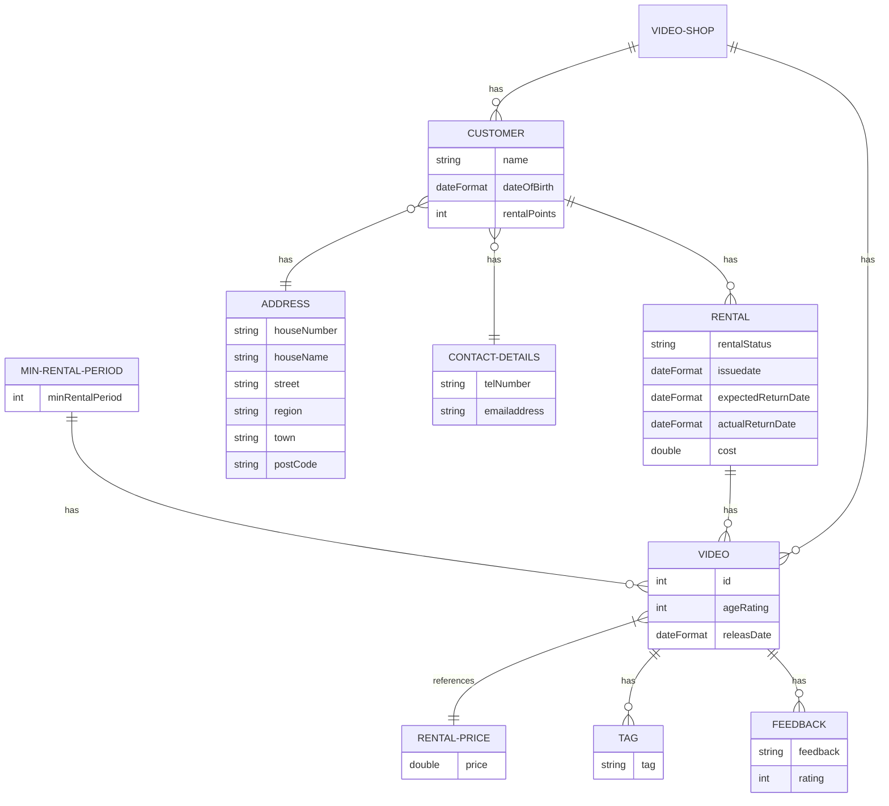

```mermaid
erDiagram
   MIN-RENTAL-PERIOD ||--o{ VIDEO : has
          MIN-RENTAL-PERIOD{
              int minRentalPeriod
          }
          VIDEO }|--|| RENTAL-PRICE : references
          RENTAL-PRICE{
              double price
          }
          VIDEO-SHOP ||--o{ CUSTOMER : has
          CUSTOMER }o--|| ADDRESS : has
          CUSTOMER{
              string name
              dateFormat dateOfBirth
              int rentalPoints
          }
          ADDRESS{
            string houseNumber
              string houseName
              string street
              string region
              string town
              string postCode
          }
          CUSTOMER }o--|| CONTACT-DETAILS : has
          CONTACT-DETAILS{
              string telNumber
              string emailaddress
          }
          CUSTOMER ||--o{ RENTAL : has
          RENTAL ||--o{ VIDEO : has
          RENTAL{
              string rentalStatus
              dateFormat issuedate
              dateFormat expectedReturnDate
              dateFormat actualReturnDate
              double cost
          }
          VIDEO-SHOP ||--o{ VIDEO : has 
          VIDEO ||--o{ TAG : has
          VIDEO{
              int id
              int ageRating
              dateFormat releasDate
          }
          TAG{
             string tag
          }
          VIDEO ||--o{ FEEDBACK : has
          FEEDBACK{
              string feedback
              int rating
          }
```
